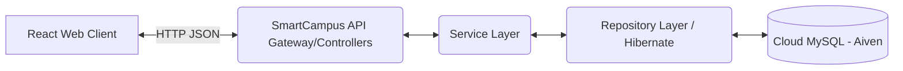
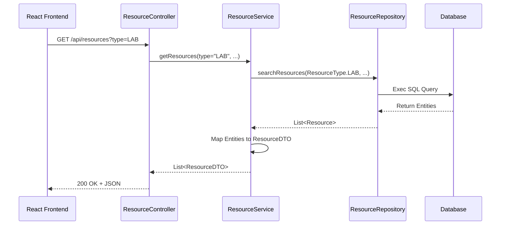

# Module A – Facilities & Assets Catalogue: Viva & Architecture Document

This document is generated to support your Academic Integrity, Viva Readiness, and Report requirements.

## 1. Requirements

### Functional Requirements
*   **REST API:**
    *   System shall allow creation, retrieval, updating, and deletion (CRUD) of bookable resources.
    *   System shall allow filtering resources by dynamic combinations of `type`, `capacity`, `location`, and partial `name`.
    *   System shall enforce enumerations for `ResourceType` (LECTURE_HALL, LAB, MEETING_ROOM, EQUIPMENT) and `ResourceStatus` (ACTIVE, OUT_OF_SERVICE).
*   **Client Web Application (React):**
    *   System shall provide an Admin Management UI to add, edit, or delete resources in the catalogue.
    *   System shall provide a Student UI (Read-Only) to view the catalogue via Google Login access.
    *   System shall present visual badges for operational status and responsive dynamic filtering of the catalogue table.

### Non-Functional Requirements
*   **Security:** Routes must be strictly protected via `ProtectedRoute.jsx` and Role-Based Access Control (Admin vs. User). Passwords must be hashed (BCrypt) via `SecurityConfig.java`.
*   **Maintainability:** Code must adhere strictly to the N-Tier Architecture (Controller > Service > Repository). DTOs must obscure database entities.
*   **Usability:** Interface must utilise intuitive modern design patterns (Shadcn UI / Tailwind CSS), ensuring seamless interactions with modal forms and immediate state updates.
*   **Reliability:** The API must robustly handle `ResourceNotFoundException` and `MethodArgumentNotValidException` via a `@ControllerAdvice` global handler.

---

## 2. Architecture Design

### Overall System Architecture

### Flow Architecture (Module A Component Level)

---

## 3. Implementation Guidelines for Viva
**If asked "Can you explain your database design?":**
*   "My implementation uses Spring Data JPA directly mapping the `Resource.java` entity to a MySQL table. I utilized Enums for strict type safety on `status` and `type` columns. Date fields generate automatically using Hibernate `@CreationTimestamp`."

**If asked "Can you explain your specific endpoints?":**
*   "In my `ResourceController`, I built 5 core RESTful endpoints. The most complex is my `GET` route which dynamically structures JPQL queries via `@Query` inside `ResourceRepository` to allow frontend users to filter by any combo of name, type, capacity, and location instantly."

---

## 4. Testing & Quality
*   **Unit Tests Added:** Located in `backend/src/test/java/smart_campus_backend/service/ResourceServiceTest.java`. Using JUnit & Mockito to isolate the service layer logic.
*   **Postman Collection:** A fully configured file `Postman_Collection_Module_A.json` is exported to your project folder for quick import and API demonstration.

---

## 5. Version Control & CI
*   **GitHub Actions:** `.github/workflows/ci.yml` has been generated for you. It automatically targets Node.js 18 builds for your frontend and JDK 17 for backend upon pushes or PRs to the `main` branch.
